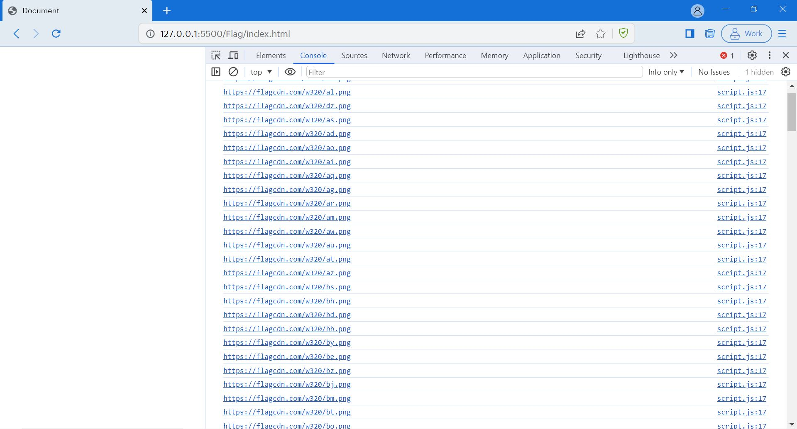
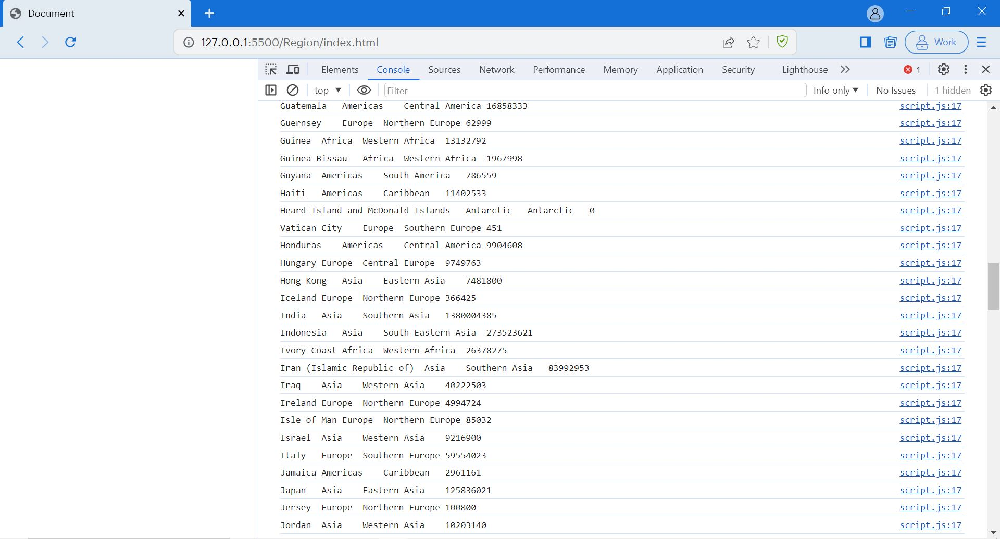

# JavaScript - Day -3: JS array & objects

1. How to compare to JSON have the same properties without order?
     a. let obj1 = {nmae:"Person1", age:5}
     b. let obj2 = {age=5, name="Person1"}
     [Solution](https://github.com/manoharsena/DAY-3/blob/main/ObjectComparison.js)

2. Use the rest countries API URL https://restcountries.com/v3.1/all and display all the country flags in the console.

 [Solution](https://github.com/manoharsena/DAY-3/tree/main/Region)
 

3. Use the same rest countries and print all countries names, regions, sub-regions and populations.

 [Solution](https://github.com/manoharsena/DAY-3/tree/main/Flag)
 
